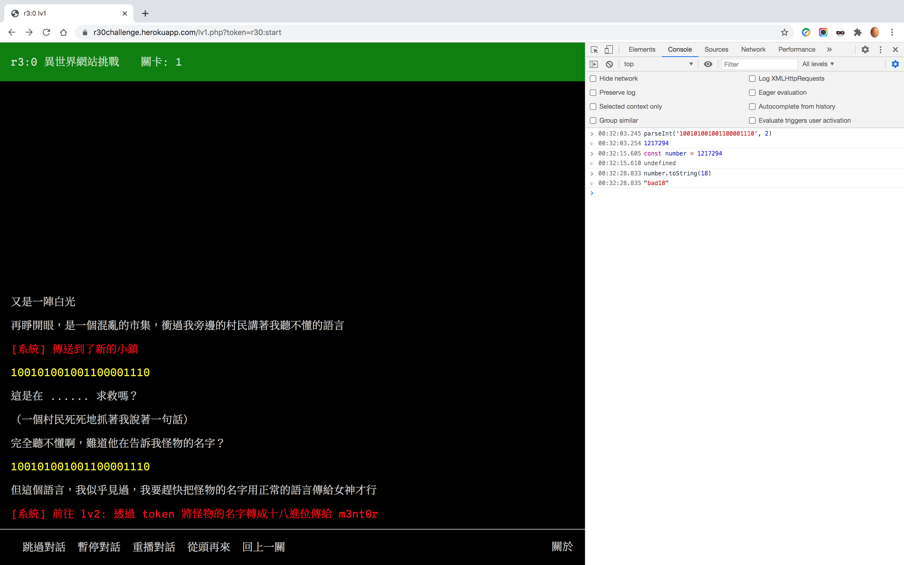
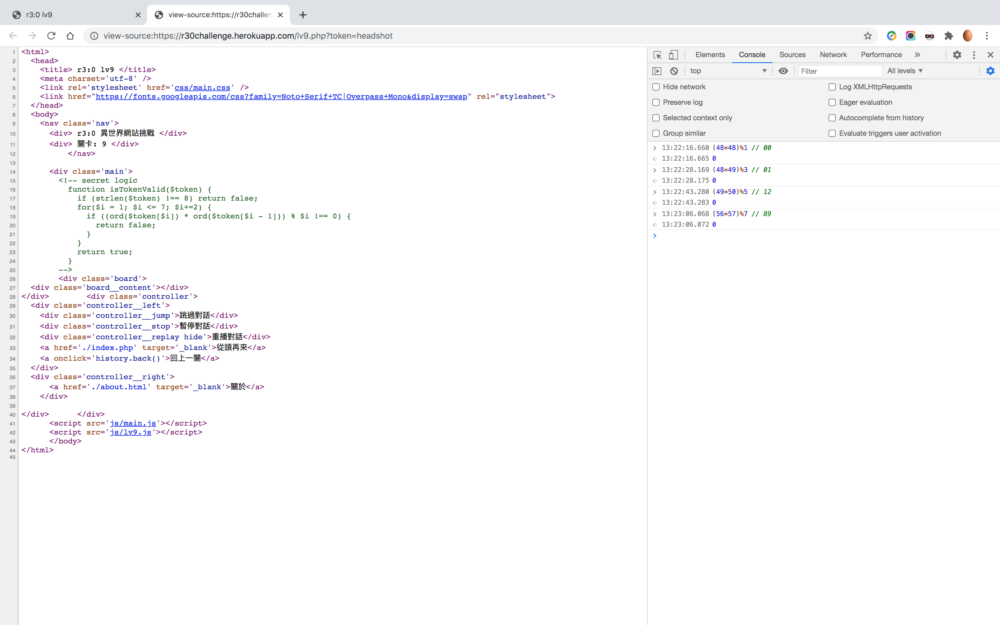
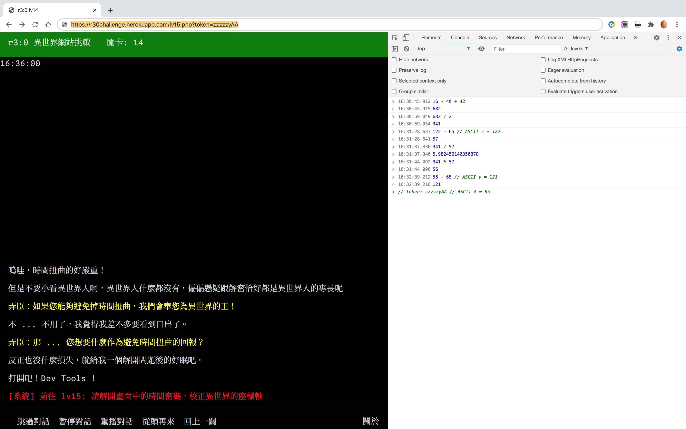
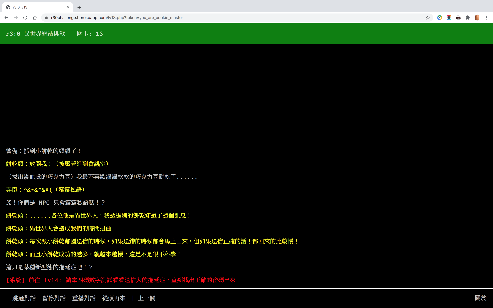
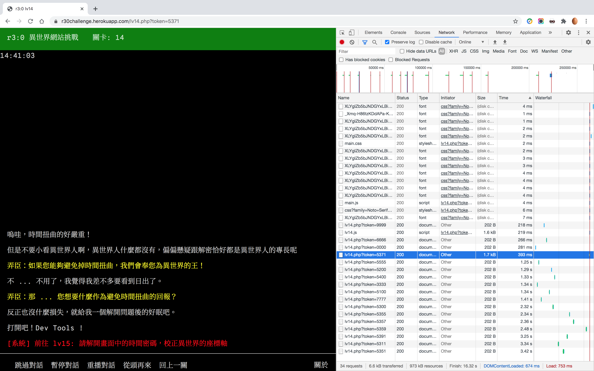

## 六到十週心得與解題心得

六到十週心得

對比其他週，因為曾自學切版，第六週課程進入比較無障礙些，考量學習時間分配，學習重點放在學習動態功能，切版以精簡不跑版為主，目前容易碰到但不熟的部分是 position、display，測試瀏覽器以 Chrome、手機版為主，尚未測試其他瀏覽器相容性。第七、八、九週就像學習不同文法、片語，例如第一次看到 `document.querySelector('form').addEventListener('submit', function(e) {…});`，對比老師示範如此行雲流水，我乍看則是滿頭霧水，從初學者視角，看到一句新文法就像看到怪獸與牠們的產地，需要時間習慣他的形式、結構與組成，才能開始記憶他的使用情境與邏輯。心得：對於初見語法採用直視法，回呼函式「見面三分熟」，納入自己的心理模型，瞬間就眼熟。

第二階段第六週到第十週，明顯進度慢了下來，直到目前第三階段複習週才正在寫第十週與第十一週作業，主要問題在於「自己寫完作業」直到看完作業講解影片與修改作業，這段過程越拉越長，有幾個狀況：沒有設定作業死線；作業卡關（等於沒有寫完作業）而不敢太快看講解影片；後來調整為作業卡關一天就直接看作業講解影片，但有自責感；有時小細節卡很久，難以評估算是求有還是求好，常常因為一股腦兒想研究看看而忘記時間；寫作業前缺乏簡易實作練習轉化課程知識，作業需要比較縝密的組織力，來不及轉換銜接。心得：增加每天實作練習時間，必須設定作業死線，如果卡關太久，就直接看影片跟做。

也因為學習進度變慢，其實無形中衍生出來的擔心焦慮會影響後續學習狀態，必須有意識的面對，避免累積成為拖延症。計畫開始至今，我的底線是提交每日進度報告，不只是為了綠色點點，而是避免自己放鬆一天，放鬆兩天，變成鬆懈，而且與其去記少寫幾天報告，不如習慣每天寫，更專注於所做的事，而不是沒做的事，即使學習狀態不好，也會保持每天回饋。李安說：「放鬆才能夠專注。」每次雜緒一起，我試著放掉情緒，想像放空狀態，承認現況也會形成放鬆狀態，就開始專注自己能做的事了。

已經學習三個月，每隔一段時間就得調整學習狀態，發現問題在於「自學」與「自我管理」沒有連結在一起，通常將自學劃入生活（自由為大），將自我管理劃入工作（紀律為大），對我這種喜歡自學但不擅長自我管理的人來說，有紀律的生活，才有更多的自由。如果可以更早準備筆記方法（工作方法）、實作練習比重（資源分配）、作業時程（時程管理），把每週課程當成一個小專案，整個計畫當成一個大專案，進行專案管理，專案目標才會明顯且不易撼動，也才會有取捨與調整次要目標的標準。參與計畫同時，也是改善我的人生，更清楚自己需要什麼，更擅長表達自己想做什麼。

一次複習五週心得太難，之後每週寫一段心得，也會比較貼近當下，希望下次複習週可以再多寫一些具體心得。

解題心得

其實本來打算略過 [r3:0 異世界網站挑戰](https://r30challenge.herokuapp.com/)，之後再補玩，點開後看一下就一直玩下去了，介面設計很親切，關卡文本寫得非常有感，老師與 minw 助教有編劇潛能。以下僅分享卡關心得。

第 1 關卡滿久的，傻到將 token=parseint(‘100101001001100001110’, 2) 直接帶入 Query String，研究一下才知道 parseInt() 是將某進位制字串轉換為十進位，再此十進位數賦值給變數 number，透過 number.toString(18) 轉換為十八進位制。

進入第 5 關後一頭霧水，沒有發現任何異狀，搜尋前輩解題心得，原來進入關卡時閃了一下，網址列可以看得出來強制跳轉頁面，進入關卡前按下 ESC，頁面下方就是 token。（原來是動態視力太差了！）

第 9 關掌握字串長度函式 strlen()、字串 ASCII 碼函式 ord()，即可算出 token。

第 11-12、14-15 關，我僅止於找到問題點就卡住了，執著於對 Query String 動歪腦筋，沒想到應該自己計算，算是很沒有遊戲腦（在此指對遊戲很有概念，非指玩遊戲過度的症狀）。詳細解法參考同學生菜 [r3:0 異世界網站挑戰 Lv. 11 ~ 15 攻略](https://www.coderbridge.com/@v61265/3b7e22d3f13845aa8872ae77973341ce)，佩服生菜同學的運算思維，脈絡清晰，讓我一看就懂，除了第 15 關難上許多，這關最後一個關鍵是得在遊戲時間當下送出 Query String。

問題：前往第 14 關：請拿四碼數字測試看看送信人的拖延症，直到找出正確密碼。為什麼「反應時間越長表示越接近標準答案」呢？除了猜數字，有沒有其他解法呢？

